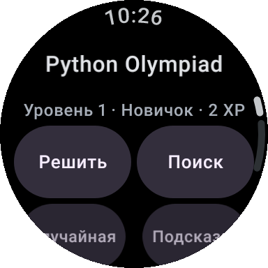
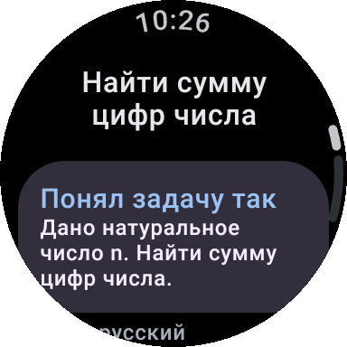
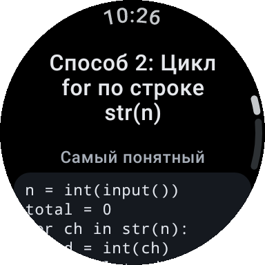
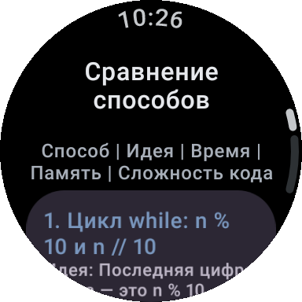
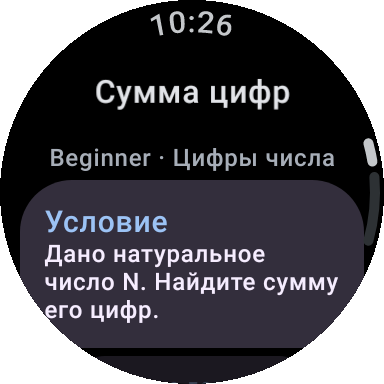
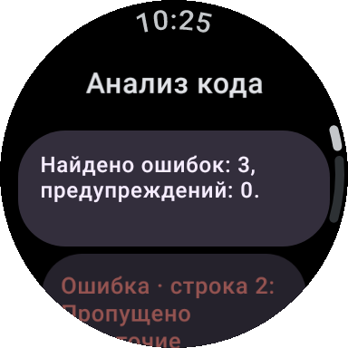
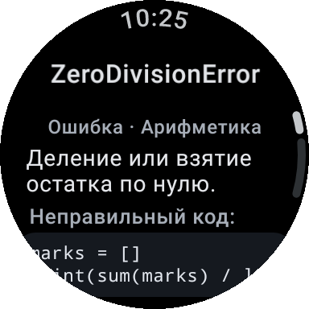
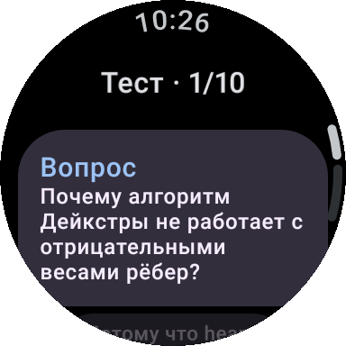

# Offline Python Olympiad Assistant для Galaxy Watch / Wear OS

Автономный помощник по Python и олимпиадному программированию для умных часов на Wear OS
(Samsung Galaxy Watch 4 и новее). Работает **полностью без интернета**: приложение не запрашивает
разрешение `INTERNET`, все знания хранятся в локальных базах SQLite, а код запускается во встроенном
интерпретаторе CPython 3.11.

<p>








</p>

Скриншоты сняты автоматическими тестами на круглом экране 192 dp (примерно как у Galaxy Watch 40 мм).

## Возможности

- **Решить задачу.** Условие вводится с клавиатуры часов (или рукописно/голосом — если это поддерживает
  клавиатура и для голоса установлен офлайн-пакет). Движок понимает русский, английский, узбекский и
  русский транслит («n natural son berilgan uning raqamlari yigindisini toping», «naiti summu cifr»),
  исправляет опечатки, определяет тему и ограничения, показывает, как понял задачу, и строит решение.
- **Несколько способов решения** — до пяти действительно разных алгоритмов (кнопки «Способ 1…5»,
  «Ещё способы», «Сравнить способы» с таблицей «Способ | Идея | Время | Память | Сложность кода»).
  Каждый способ проверяется на примерах встроенным Python; неверные и дублирующие способы удаляются.
  Если надёжного решения нет, приложение честно пишет: «Не удалось надёжно определить решение.
  Попробуйте переформулировать условие» — и предлагает похожие задачи и темы.
- **База задач:** 292 собственные задачи уровней Beginner → Olympiad по 35 темам, у каждой условие,
  ограничения, примеры, три подсказки (от лёгкой до почти решения), 2–4 проверенных решения
  с оценкой сложности, объяснение и скрытые тесты. Тренировки на 10/20/50/100 задач, олимпиадный режим
  (решение скрыто до подсказок), проверка своего решения на тестах прямо на часах.
- **Справочник Python на русском:** встроенные функции, ключевые слова, операторы, методы типов,
  45 тематических статей (от `print` до метаклассов, asyncio и упаковки), устройство CPython
  (байт-код, AST, GIL, сборщик мусора, новые версии), 55 модулей стандартной библиотеки с примерами,
  а также официальная документация (EN) по всем публичным функциям 139 модулей.
- **Внешние библиотеки (справочник):** NumPy, Pandas, Matplotlib, Requests, BeautifulSoup, Flask, Django,
  FastAPI, Pygame, Pillow, OpenCV, scikit-learn, PyTorch, TensorFlow, SQLAlchemy, Selenium, pytest —
  обзоры с примерами, которые были выполнены настоящими библиотеками при сборке, и справка по ≈3800
  функциям. На часах эти библиотеки не устанавливаются и не запускаются.
- **51 тема алгоритмов** (теория, шаблоны, O(…), типичные ошибки, связанные задачи), **31 разбор ошибок**
  (неправильный код → реальный вывод Python → исправление → учебная задача), **303 тестовых вопроса**
  в шести категориях (Basics, Syntax, Output, Algorithms, Data Structures, Olympiad) в режимах 10/20/50.
- **Python Run и анализатор кода:** построчный редактор для экрана часов (автоотступ, шаблоны,
  исправление «умных» кавычек), запуск во встроенном CPython 3.11 с вводом, ограничением времени и вывода;
  анализ синтаксиса, скобок, отступов, переменных, типичных ошибок и сложности с автоисправлением.
- **Поиск** по всем базам: RU/EN/UZ, транслит, синонимы, префиксы («sor» → sorted), опечатки.
- **Каталог открытых проектов:** 83 проекта с описанием, языком, лицензией и ссылкой на официальный
  репозиторий (ссылки, лицензии и версии взяты из метаданных PyPI).
- **Прогресс и избранное:** XP и уровни, решённые задачи, попытки, подсказки, тесты, сильные и слабые
  темы, рекомендации; в избранное сохраняются задачи, функции, методы, алгоритмы, библиотеки, ошибки,
  статьи, а также решения и собственный код (кнопка «★ Сохранить решение»).

## Требования

- Android Studio последней стабильной версии (проект использует Android Gradle Plugin 8.13,
  Gradle 8.14.3, Kotlin 2.2, compileSdk 36). JDK 17 или новее — подходит встроенный в Android Studio.
- Android SDK Platform 36 (Android Studio предложит установить при синхронизации).
- Рекомендуется Python 3.11 в системе: плагин Chaquopy использует его, чтобы заранее скомпилировать
  Python-файлы в байт-код (ускоряет запуск). Без него сборка тоже проходит.
- Часы: Wear OS 3 или новее (Galaxy Watch 4, 5, 6, 7, Ultra и новее), около 150 МБ свободного места.

## 1. Как открыть проект в Android Studio

1. Скопируйте папку проекта на компьютер (или выполните `git clone` репозитория).
2. Запустите Android Studio → **File → Open…** (или **Open** на стартовом экране).
3. Выберите корневую папку проекта — ту, где лежит `settings.gradle.kts`, — и нажмите **OK**.
4. Если Android Studio спросит про доверие проекту, выберите **Trust Project**.

## 2. Как синхронизировать Gradle

- Синхронизация начнётся автоматически. Если нет — **File → Sync Project with Gradle Files**
  (значок слона с синей стрелкой).
- При первой синхронизации Gradle скачает зависимости (Compose for Wear OS, Chaquopy и др.) — нужен
  интернет на компьютере (часам интернет не нужен никогда).
- Если появится сообщение о недостающем SDK, нажмите предложенную ссылку **Install missing SDK…**
  или установите **Android 16 (API 36)** в **Tools → SDK Manager**.
- Путь к SDK Android Studio сам запишет в `local.properties`.

## 3. Как собрать APK

В Android Studio: **Build → Build App Bundle(s) / APK(s) → Build APK(s)**. Готовый файл:
`app/build/outputs/apk/debug/app-debug.apk`.

Из командной строки (в корне проекта):

```bash
./gradlew :app:assembleDebug        # отладочная сборка (Windows: gradlew.bat :app:assembleDebug)
./gradlew :app:assembleRelease      # оптимизированная сборка (R8), подписана отладочным ключом
```

Release-APK: `app/build/outputs/apk/release/app-release.apk` (≈53 МБ, содержит Python для
`armeabi-v7a`, `arm64-v8a` и `x86_64`). Чтобы собрать APK только для архитектуры ваших часов
(меньше размер), укажите ABI:

```bash
./gradlew :app:assembleRelease -Ppyolymp.abis=arm64-v8a
```

Для публикации в магазине замените в `app/build.gradle.kts` подпись `signingConfig` на свою.

## 4. Как включить режим разработчика на Galaxy Watch

1. На часах откройте **Настройки → О часах → Программное обеспечение** (на некоторых версиях:
   **Сведения о ПО**).
2. Нажмите на **Версия ПО** несколько раз подряд (обычно 5–7), пока не появится сообщение
   «Режим разработчика включён».
3. Вернитесь в **Настройки** — появится пункт **Параметры разработчика**.
4. В **Параметрах разработчика** включите **Отладка ADB** (ADB debugging) и
   **Беспроводная отладка** (Wireless debugging / Debug over Wi-Fi).

## 5. Как подключить часы

Часы и компьютер должны быть в одной сети Wi-Fi. Нужна утилита `adb` из Android SDK
(`<SDK>/platform-tools/adb`; в Android Studio путь виден в **SDK Manager → Android SDK Location**).

1. На часах: **Параметры разработчика → Беспроводная отладка → Связать новое устройство**
   (Pair new device). Часы покажут код сопряжения, IP-адрес и порт.
2. На компьютере:
   ```bash
   adb pair 192.168.1.50:37123      # IP и порт из окна сопряжения, затем ввести код с часов
   adb connect 192.168.1.50:41567   # IP и порт из экрана «Беспроводная отладка»
   adb devices                      # часы должны появиться в списке как "device"
   ```
3. При первом подключении подтвердите на часах запрос «Разрешить отладку?».

В Android Studio часы также можно подключить через **Device Manager → Pair Devices Using Wi-Fi**.

## 6. Как установить APK через ADB

```bash
adb install -r app/build/outputs/apk/release/app-release.apk
# если подключено несколько устройств:
adb -s 192.168.1.50:41567 install -r app/build/outputs/apk/release/app-release.apk
```

Флаг `-r` переустанавливает приложение с сохранением данных. Можно также нажать **Run ▶** в Android Studio,
выбрав часы в списке устройств.

## 7. Как запустить

- На часах откройте список приложений и выберите **Python Olympiad**.
- Первый запуск: приложение распаковывает базы знаний (≈25 МБ) во внутреннюю память — индикатор на
  главном экране. Повторные запуски мгновенные.
- Главный экран: быстрые кнопки **Решить, Поиск, Случайная, Подсказка, Ответ, Справка** и разделы
  **Python, Решить задачу, Олимпиада, Задачи, Алгоритмы, Функции, Библиотеки, Ошибки, Тесты, Поиск,
  Избранное, Прогресс, Python Run, Настройки**.
- Ввод текста — системная клавиатура часов. Свайп вправо — назад.
- Для быстрой проверки решателя условие можно передать командой:
  ```bash
  adb shell am start -n com.pyolympiad.watch/.MainActivity --es task "Дано натуральное число n. Найдите сумму его цифр."
  ```
- В **Настройках** — размер шрифта, олимпиадный режим, ограничение времени запуска кода,
  показ хода рассуждений решателя.

## 8. Как проверить, что приложение работает полностью офлайн

1. Убедитесь, что APK не запрашивает доступ в интернет:
   ```bash
   $ANDROID_HOME/build-tools/36.0.0/aapt2 dump permissions app/build/outputs/apk/release/app-release.apk
   ```
   В выводе нет `android.permission.INTERNET` — система не даст приложению выйти в сеть.
2. На часах включите **Режим полёта**, выключите Wi-Fi, Bluetooth и LTE (или отсоедините часы от телефона).
3. Откройте приложение и проверьте: решение задачи (например, «sum of digits of n»), несколько способов
   и их сравнение, поиск («sortirovka», «словарь», «deque»), задачу с подсказками и проверкой своего
   решения, тест на 10 вопросов, запуск кода в **Python Run** и анализатор. Всё работает без сети.

## Архитектура

```
app/                      Wear OS приложение (Kotlin, Jetpack Compose for Wear OS, Material 3)
  ui/screens/             экраны: главный, решатель, способы, сравнение, задачи, тренировка,
                          тесты, справочник, поиск, избранное, прогресс, настройки, редактор, анализатор
  runtime/PythonRuntime   CPython 3.11 через Chaquopy: запуск, проверка синтаксиса, тестирование решений
  src/main/python/        pyolymp_runner.py — изолированный запуск кода с вводом, таймаутом и лимитом вывода
  src/main/assets/        базы знаний SQLite, словари решателя, синонимы, транслит
core/engine/              «движок знаний» на чистом Kotlin (тестируется на JVM):
  text/, nlp/             нормализация, транслит, язык, стемминг, нечёткое сравнение, разбор условия
  solver/                 конвейер решения: понимание → тема → ограничения → выбор алгоритма →
                          генерация кода → проверка → объяснение; 136 именованных алгоритмов
                          (solver/skills/*.md) и генератор задач на последовательности
  analyzer/               лексер Python, статический анализ, автоисправления, оценка сложности
  search/                 расширение запросов: синонимы, транслит, «скелеты» слов для опечаток
core/data/                установка баз из assets, полнотекстовый поиск FTS4 с ранжированием,
                          прогресс, избранное, история (UserStore)
content/                  исходные тексты базы знаний (Markdown) — задачи, алгоритмы, ошибки,
                          тесты, справочник Python, библиотеки, каталог проектов
tools/build_content.py    сборка баз: проверяет и исполняет все примеры, строит SQLite + FTS
```

Базы разделены по областям (`python.db`, `libraries.db`, `algorithms.db`, `tasks.db`, `errors.db`,
`tests.db`, `github.db`), открываются по требованию и не загружаются в память целиком; поиск идёт через
индексы FTS4. Тяжёлые компоненты (движок, интерпретатор Python) создаются лениво.

## Как собирается и проверяется база знаний

Содержимое — собственные тексты, задачи и решения; справочник по API берётся из официальных
docstring'ов CPython и открытых библиотек (с указанием источника), репозитории каталога — из метаданных PyPI.

```bash
python3.11 tools/build_content.py              # пересобрать базы (нужен Python 3.11 — версия на часах)
python3.11 tools/build_content.py --check      # только проверка
tools/setup_extlibs.sh                         # (необязательно) окружение с внешними библиотеками;
TF_CPP_MIN_LOG_LEVEL=3 tools/.cache/extvenv/bin/python tools/build_content.py   # полная сборка
```

При сборке:
- каждый пример кода исполняется в Python 3.11; результат сохраняется и показывается в приложении;
- каждое решение каждой задачи прогоняется на всех примерах и сгенерированных тестах, ответы всех
  способов сравниваются между собой;
- «неправильный код» в разборах ошибок обязан вызвать указанное исключение, исправленный — работать;
- ответы тестов «что выведет», «какая ошибка», «какой тип» вычисляются выполнением кода;
- для каждой упомянутой функции (`check:`) проверяется, что она существует в Python 3.11.

## Тесты

```bash
./gradlew :core:engine:test                                   # решатель (86 «золотых» условий), генератор,
                                                              # анализатор, совпадение Kotlin/Python-нормализации
./gradlew :app:testDebugUnitTest -Ppyolymp.abis=x86_64        # базы знаний и поиск (Robolectric),
                                                              # все основные экраны на круглых дисплеях
                                                              # 192 dp и 227 dp и с крупным шрифтом
./gradlew :app:recordRoborazziDebug -Ppyolymp.abis=x86_64     # то же + сохранить скриншоты
                                                              # в app/build/outputs/roborazzi
```

## Ограничения

- Встроенный Python — CPython 3.11 со стандартной библиотекой. Внешние пакеты (NumPy, Pandas и т. п.)
  на часах не устанавливаются; для них есть только справочник. `multiprocessing` на Android недоступен,
  запуск внешних программ (`subprocess`) и сетевые запросы на часах не работают.
- Решатель строит программы для типовых формулировок (последовательности и числа, цифры, строки,
  массивы, сортировки, поиск, префиксные суммы, НОД/простые, комбинаторика, DP, графы и др.). Для
  нестандартных условий он честно сообщает, что не уверен, и показывает близкие задачи и темы базы.
- Голосовой ввод зависит от клавиатуры часов и наличия офлайн-пакета распознавания речи.
- Очень длинная операция внутри одной C-функции (например, `10 ** 10 ** 8`) не прерывается таймаутом
  до своего завершения.
